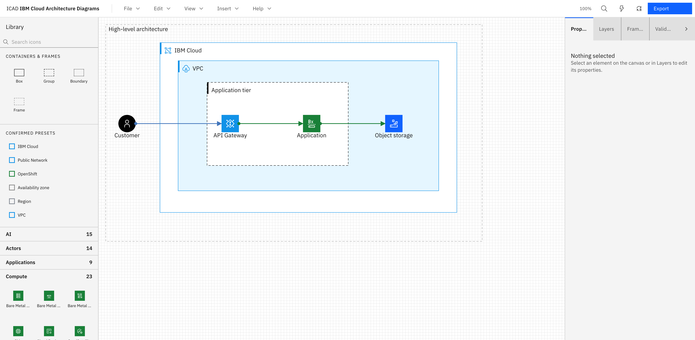
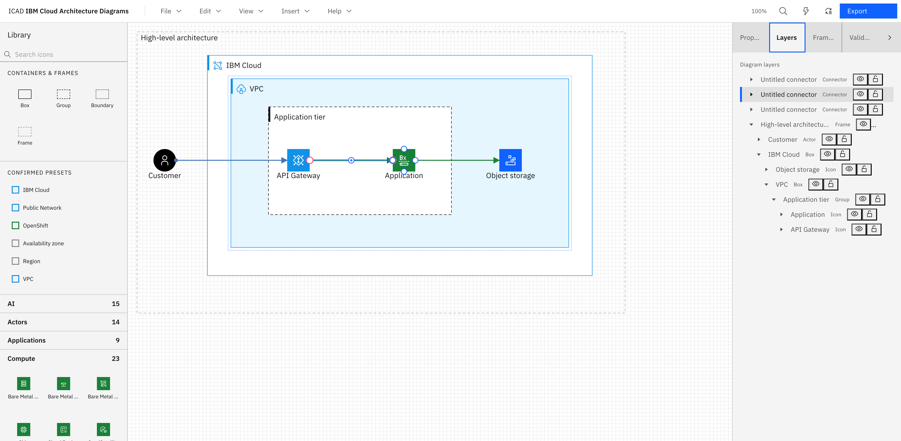
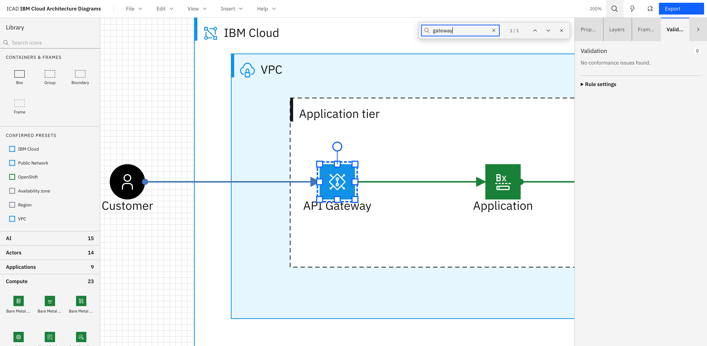
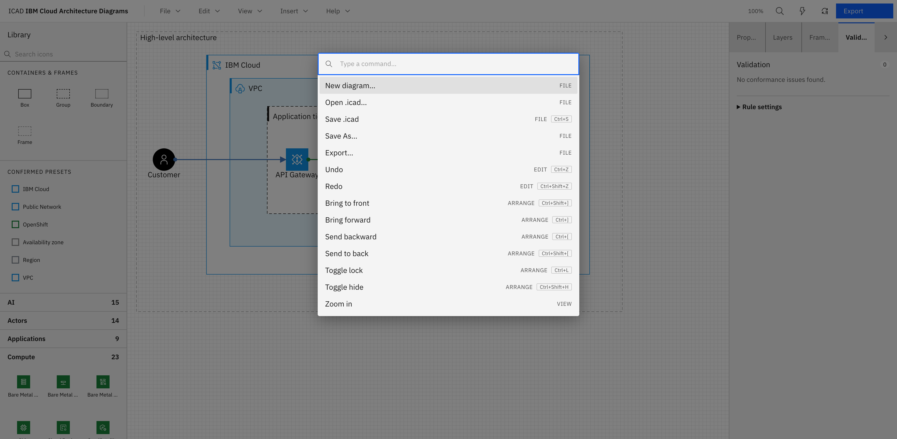
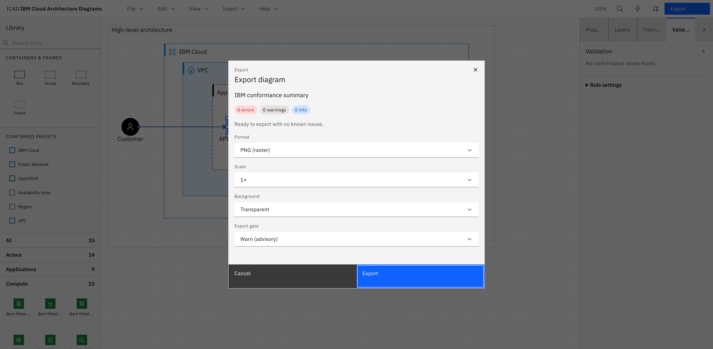

# ICAD — IBM Cloud Architecture Diagrams

A purpose-built editor for **IBM Cloud architecture diagrams** — "Excalidraw, but for IBM Cloud,
and spec-aware." It renders crisp, IBM-Design-faithful diagrams, understands IBM element semantics
natively (`deployedOn` / `deployedTo`, nodes, actors, zones), saves to a first-class **`.icad`**
file, and can be driven by AI agents through an MCP server and Agent Skills.

> **Positioning:** official IBM-internal tool. Uses the sanctioned
> [IBM Cloud architecture icons](https://github.com/IBM-Cloud/architecture-icons); the _official_
> release is gated by IBM Design sign-off ([D17](./docs/decision-log.md#d17--official--ibm-internal-tool--locked)).
> The [Releases page](../../releases) below is a separate, unsigned **preview** channel, not that
> sanctioned release.



## Download

Preview builds — unsigned, not yet IBM-Design-sign-off-gated (see the positioning note above) —
are published to the [GitHub Releases page](../../releases) on tagged pushes: desktop installers
(macOS/Windows/Linux), a VS Code `.vsix`, a standalone MCP server tarball, and a web app static
build. Expect Gatekeeper (macOS) / SmartScreen (Windows) warnings on the desktop installers, since
they're unsigned.

## Maturity

The core engine, IBM icon catalog, linter, templates, file format, and MCP agent toolset are all
built and in daily-use shape in the web app. The VS Code extension and desktop app are functional
— same engine, same UI — and now packaged as downloadable preview builds (above), though still
short of a Marketplace listing or a signed/notarized installer. See each surface's guide for
exactly what's there today and what isn't:
[web editor](./apps/web/docs/web-editor.md#limitations),
[VS Code](./apps/vscode/docs/vscode-extension.md#limitations),
[desktop](./apps/desktop/docs/desktop-app.md#limitations),
[MCP/agents](./packages/mcp/docs/ai-agents-mcp.md#limitations).

---

## Why this exists

The sanctioned path today is **draw.io + the IBM Cloud stencil library**. It works, but nothing
enforces the IBM conventions, draw.io has no IBM semantics to validate or autocomplete against,
there's no first-class file identity, and there's no clean way for an agent to author a diagram.
ICAD fixes all four. See [Vision & Scope](./docs/vision-and-scope.md).

## What makes it different

- **Spec-aware, not generic.** Shapes carry IBM meaning; an advisory **linter** with quick-fixes
  keeps diagrams on-spec. → [Spec Conformance](./packages/core/docs/ibm-spec-conformance.md)
- **Crisp & on-brand.** Exact IBM icons (a solid category-color 48×48 tile with a 24×24 white
  glyph, matching IBM's own construction), orthogonal connectors, Carbon + IBM Plex chrome — no
  hand-drawn look. → [The web editor](./apps/web/docs/web-editor.md)
- **Files-first & git-friendly.** Local-first single-file JSON `.icad`; SVGs embed a re-editable
  copy. → [File Format](./packages/core/docs/file-format.md)
- **Machine-authorable.** One headless engine drives both the human editor and an MCP server, so
  agents and people edit the same diagrams. → [AI agents & MCP](./packages/mcp/docs/ai-agents-mcp.md)
- **Accessible by requirement.** IBM Equal Access / WCAG 2.1 AA, including a keyboard-operable,
  screen-reader-navigable canvas. → [Accessibility](./packages/core/docs/accessibility.md)

## Features

- **Semantic elements & containers** — Box (`deployedOn`), Group (`deployedTo`), Zone/Boundary,
  Actor, Icon, Text, Frame, with move-with/cascade-delete containment and 11 IBM connector types.
- **Direct manipulation on the real canvas** — drag-to-move, 8-handle resize, rotate with 15°
  snapping, marquee select, align/distribute, z-order, lock/hide, and a full clipboard, plus
  manual connector-waypoint editing — every gesture is undoable and reaches the MCP surface too.
- **241 bundled IBM icons** across 11 categories — searchable, offline, no network dependency.
- **Advisory linter** — 25 rules, one-click quick-fixes, a configurable export gate.
- **Four starting templates** — Blank, System context, High-level, Detailed — all pre-built and
  spec-conformant.
- **Find on canvas**, a full command palette, and Auto/Light/Dark themes.
- **`.icad` file format** — versioned JSON, autosave + crash recovery, SVG (re-editable) and PNG
  export.
- **Full keyboard operability** and WCAG 2.1 AA accessibility on the canvas itself, not just the
  chrome.
- **Four surfaces** — [web app](./apps/web/docs/web-editor.md), [VS Code extension](./apps/vscode/docs/vscode-extension.md),
  [desktop app](./apps/desktop/docs/desktop-app.md), and an [MCP server + Agent Skills](./packages/mcp/docs/ai-agents-mcp.md)
  for AI-agent authoring.

**Known limitations today:** VS Code and desktop are unsigned preview builds, not yet on the VS
Code Marketplace or signed/notarized. MCP export is SVG-only. Full detail in each guide doc's own
Limitations section, linked above.

## A closer look

<table>
<tr>
<td width="33%"><a href="./apps/web/docs/web-editor.md#placing-icons"></a><br><sub><b>Library panel</b> — searchable, offline IBM icon catalog</sub></td>
<td width="33%"><a href="./apps/web/docs/web-editor.md#properties-layers-frames-validation"></a><br><sub><b>Properties</b> — rotation, IBM palette + custom color picker, lock/hide</sub></td>
<td width="33%"><a href="./apps/web/docs/web-editor.md#connectors"></a><br><sub><b>Connector editing</b> — drag waypoints, retarget endpoints, reset routing</sub></td>
</tr>
<tr>
<td><a href="./apps/web/docs/web-editor.md#properties-layers-frames-validation"></a><br><sub><b>Layers</b> — full containment tree, per-row lock/hide</sub></td>
<td><a href="./apps/web/docs/web-editor.md#the-linter"></a><br><sub><b>Linter</b> — advisory diagnostics with one-click quick-fixes</sub></td>
<td><a href="./apps/web/docs/web-editor.md#find-on-canvas"></a><br><sub><b>Find on canvas</b> — jumps the viewport to each match</sub></td>
</tr>
<tr>
<td><a href="./apps/web/docs/web-editor.md#command-palette"></a><br><sub><b>Command palette</b> — every action, one search box</sub></td>
<td><a href="./docs/guide/getting-started.md#your-first-diagram"></a><br><sub><b>Templates</b> — four pre-built, spec-conformant starting points</sub></td>
<td><a href="./apps/web/docs/web-editor.md#export"></a><br><sub><b>Export</b> — SVG (re-editable) or PNG, with a conformance summary</sub></td>
</tr>
</table>

## Documentation

Docs live **next to the code they describe**. Only cross-cutting records — the ones that span more
than one package — stay at the repo root. This table is the single entry point for all of them.

**Start here — the user guide:**

| Doc                                                             | Where it lives       | What's inside                                          |
| --------------------------------------------------------------- | -------------------- | ------------------------------------------------------ |
| [Getting started](./docs/guide/getting-started.md)              | `docs/guide/`        | Install, run, create your first diagram                |
| [The web editor](./apps/web/docs/web-editor.md)                 | `apps/web/docs/`     | Every element, interaction, panel, and menu            |
| [The VS Code extension](./apps/vscode/docs/vscode-extension.md) | `apps/vscode/docs/`  | What it is, how to run it, what differs from web       |
| [The desktop app](./apps/desktop/docs/desktop-app.md)           | `apps/desktop/docs/` | What's native, how to build it, what's missing         |
| [AI agents & MCP](./packages/mcp/docs/ai-agents-mcp.md)         | `packages/mcp/docs/` | The 46-tool MCP server, Agent Skills, a worked example |
| [File format & export](./docs/guide/file-format-and-export.md)  | `docs/guide/`        | `.icad` shape, SVG/PNG export                          |

**Cross-cutting records** (repo root, `docs/`) — the project as a whole:

| Doc                                            | What's inside                                                              |
| ---------------------------------------------- | -------------------------------------------------------------------------- |
| [Architecture](./docs/architecture.md)         | System structure, the core/shell split, data and command flow, docs layout |
| [Decision log](./docs/decision-log.md)         | Every locked decision (D1–D37) with its rationale and consequences         |
| [Vision & scope](./docs/vision-and-scope.md)   | What this is for, and what it deliberately isn't                           |
| [Roadmap](./docs/roadmap.md)                   | Milestones M1–M33 as shipped, and what's next                              |
| [Improvement plan](./docs/improvement-plan.md) | Current audit: confirmed defects, I1–I17, proposed M34–M40 sequencing      |

**Package-level design docs** — for anyone working on that package:

| Package                                                                                      | Docs                                                                                                                                                                                                                                                                                                   |
| -------------------------------------------------------------------------------------------- | ------------------------------------------------------------------------------------------------------------------------------------------------------------------------------------------------------------------------------------------------------------------------------------------------------ |
| [`packages/core`](./packages/core)                                                           | [File format](./packages/core/docs/file-format.md) · [IBM spec conformance](./packages/core/docs/ibm-spec-conformance.md) · [Editor UX](./packages/core/docs/editor-ux.md) · [Accessibility](./packages/core/docs/accessibility.md) · [Canvas parity plan](./packages/core/docs/canvas-parity-plan.md) |
| [`packages/catalog-build`](./packages/catalog-build)                                         | [Icon catalog pipeline](./packages/catalog-build/docs/icon-catalog.md)                                                                                                                                                                                                                                 |
| [`packages/mcp`](./packages/mcp)                                                             | [AI agents & MCP](./packages/mcp/docs/ai-agents-mcp.md) · [Agent integration spec](./packages/mcp/docs/agent-integration.md)                                                                                                                                                                           |
| [`packages/ui-web`](./packages/ui-web)                                                       | README only — panels are documented alongside core's [Editor UX](./packages/core/docs/editor-ux.md)                                                                                                                                                                                                    |
| [`packages/catalog`](./packages/catalog)                                                     | Generated; see the pipeline doc above                                                                                                                                                                                                                                                                  |
| [`apps/agent`](./apps/agent)                                                                 | [Agent runtime](./apps/agent/docs/agent-runtime.md)                                                                                                                                                                                                                                                    |
| [`apps/web`](./apps/web) · [`apps/vscode`](./apps/vscode) · [`apps/desktop`](./apps/desktop) | Their user guides, linked in the first table                                                                                                                                                                                                                                                           |

Screenshots used across every doc live in one place: [`docs/screenshots/`](./docs/screenshots/).

## Architecture at a glance

```
packages/core        framework-agnostic TS engine (scene, commands, SVG render, linter, io, catalog, api)
packages/catalog     generated IBM icon catalog (manifest + optimized SVGs)
packages/catalog-build  build-time IBM stencil → catalog converter
packages/ui-web      Carbon + IBM Plex app chrome (React)
packages/mcp         MCP server + Agent Skills wrapping core/api
apps/web             web shell (Vite)
apps/vscode          VS Code custom editor for .icad (unsigned preview .vsix; no Marketplace listing yet)
apps/desktop         Tauri desktop shell (unsigned preview installers; no signed/notarized build yet)
apps/agent           Deep Agents runtime driving the MCP server, exposed over A2A
```

Every package carries its own `README.md` with what it is, how to build it, and an index of its
docs. The core has **no UI-framework dependency**; every mutation is a **command** (so undo,
autosave, and the MCP server share one path); rendering and export both target **SVG**. Details in
[Architecture](./docs/architecture.md).

## The `.icad` file

A single human-readable JSON file. Icons are referenced by catalog ID (not embedded), so files are
tiny and diff cleanly in git. Full schema in [File format & export](./docs/guide/file-format-and-export.md)
(design rationale in [packages/core/docs/file-format.md](./packages/core/docs/file-format.md)).

## Tech stack

TypeScript (strict) · custom SVG DOM renderer · React + Carbon Design System + IBM Plex (shells) ·
pnpm workspaces · Vite · Vitest / Playwright / IBM Equal Access checks. Node ≥ 20, pnpm ≥ 9.

## Getting started

```bash
pnpm install
pnpm --filter @icad/core build              # build the engine
pnpm --filter @icad/web dev                 # run the web editor (http://localhost:5173)
```

The web app renders the real, bundled IBM icon catalog (`packages/catalog`, generated by
[`packages/catalog-build`](./packages/catalog-build/docs/icon-catalog.md) from a pinned
[IBM-Cloud/architecture-icons](https://github.com/IBM-Cloud/architecture-icons) commit) — 241
icons across 11 categories. Full walkthrough in [Getting started](./docs/guide/getting-started.md).

Other surfaces:

```bash
pnpm --filter icad-vscode build             # then launch "Run ICAD Extension" in VS Code
pnpm --filter @icad/desktop dev             # native desktop shell (dev mode)
pnpm --filter @icad/mcp build               # MCP server for AI-agent authoring
```

See [The VS Code extension](./apps/vscode/docs/vscode-extension.md), [The desktop app](./apps/desktop/docs/desktop-app.md),
and [AI agents & MCP](./packages/mcp/docs/ai-agents-mcp.md) for how to actually run each.

## References

- [IBM Cloud — Creating an architecture diagram](https://cloud.ibm.com/docs/architecture-framework?topic=architecture-framework-architecture-diagram)
- [IBM-Cloud/architecture-icons](https://github.com/IBM-Cloud/architecture-icons)
- [IBM Design Language](https://www.ibm.com/design/language/) · [Carbon Design System](https://carbondesignsystem.com/) · [IBM Equal Access Toolkit](https://www.ibm.com/able/toolkit/)
