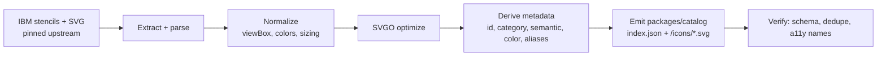

# Icon Catalog

The catalog is the bundled, offline, versioned set of IBM icons the editor draws from. It is
**generated at build time** from IBM's published stencils ([D11](00-decision-log.md#d11--build-time-icon-conversion-bundled-offline-catalog--locked)).

## Source of truth

[IBM-Cloud/architecture-icons](https://github.com/IBM-Cloud/architecture-icons) provides icons as
draw.io stencils (`drawio/stencils/2.0/`), draw.io templates, PowerPoint, and SVG. Per IBM's docs,
icons are **20×20 glyphs in a 48×48 container, white fill, 1px outline**, organized by category and
sorted groups-first, then by color, then alphabetically. Some icons are "complementary" (not yet
published natively in draw.io); we track those too.

We pin a specific upstream commit/tag per catalog `version` (e.g. `2.0.0`) so builds are
reproducible and `.icad` files that reference `catalog.version` always resolve.

## Build pipeline (`packages/catalog-build`)



Steps:

1. **Extract** shapes from IBM draw.io stencil XML and the SVG set (including the
   "not released in draw.io" complementary set).
2. **Normalize** to a canonical 48×48 container, consistent viewBox, and IBM color tokens; strip
   editor-specific cruft.
3. **Optimize** each SVG (SVGO) for crisp, small, inlineable assets.
4. **Derive metadata** per icon: stable `id`, display `name`, `category`, default `semantic`,
   `color`, search `keywords`, and `aliases` (old→new IDs for migration).
5. **Emit** `packages/catalog/<version>/` = an `index.json` manifest + individual optimized SVGs.
6. **Verify**: schema-valid, no duplicate IDs, every icon has an accessible name, container spec
   respected.

Re-running the pipeline against a newer upstream tag produces a new catalog version; we add
`aliases` for anything renamed so existing files migrate cleanly.

## Catalog manifest schema

```jsonc
// packages/catalog/2.0.0/index.json
{
  "id": "ibm-cloud",
  "version": "2.0.0",
  "upstream": { "repo": "IBM-Cloud/architecture-icons", "ref": "…commit…" },
  "categories": [
    { "id": "compute",  "name": "Compute" },
    { "id": "network",  "name": "Network" },
    { "id": "storage",  "name": "Storage" },
    { "id": "security", "name": "Security" },
    { "id": "data",     "name": "Data" },
    { "id": "devops",   "name": "DevOps" },
    { "id": "ai",       "name": "AI" },
    { "id": "actors",   "name": "Actors" },
    { "id": "groups",   "name": "Groups" }
    /* …IBM Core, IBM Cloud, Domains/Industries, 3rd Party groupings… */
  ],
  "icons": [
    {
      "id": "ibm-cloud/vpc",
      "name": "Virtual Private Cloud",
      "category": "network",
      "semantic": "node",              // default IBM meaning when placed
      "container": "square",
      "color": "#0f62fe",
      "asset": "icons/network/vpc.svg",
      "keywords": ["vpc", "virtual private cloud", "gen2"],
      "aliases": ["ibm-cloud/gen2-vpc"],
      "tier": "ibm-cloud"              // ibm-core | ibm-cloud | domains | third-party
    }
  ]
}
```

## Runtime API (`core/catalog`)

The core loads the manifest for the pinned version and exposes:

```ts
catalog.search(query): IconMeta[];           // fuzzy over name/keywords/aliases
catalog.byCategory(id): IconMeta[];
catalog.resolve("ibm-cloud/vpc"): IconMeta;  // + aliases fallback
catalog.svg(id): string;                     // inlineable optimized SVG
```

The editor's shape/library panel groups by IBM category and tier, mirroring draw.io's grouping so
the tool feels familiar. Search matches the native + complementary sets, like the IBM draw.io
search.

## Licensing & branding

As an official IBM tool ([D17](00-decision-log.md#d17--official--ibm-internal-tool--locked)), use of the IBM icons and brand is sanctioned. We still
record the upstream `ref` and license in the manifest and honor the icon repo's terms. IBM Design
sign-off applies to how icons/colors are rendered.

## Versioning strategy

- Catalog versions are semver, independent of app version.
- `.icad` files pin a catalog version; the app bundles the current + a compatibility shim of
  `aliases` so older files resolve.
- Bumping the catalog is a deliberate, reviewed change (IBM Design sign-off), not automatic.
