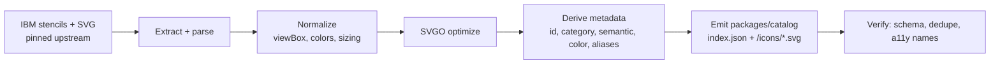

# Icon Catalog

The catalog is the bundled, offline, versioned set of IBM icons the editor draws from. It is
**generated at build time** from IBM's published stencils ([D11](00-decision-log.md#d11--build-time-icon-conversion-bundled-offline-catalog--locked)).

> **Status:** implemented ([Roadmap M2](09-roadmap.md#m2--icon-catalog-pipeline)).
> `packages/catalog-build` has generated `packages/catalog/2.0.0` — 207 icons across 10 categories
> (`ai`, `actors`, `applications`, `compute`, `data`, `devops`, `network`, `observability`,
> `security`, `storage`), pinned at upstream commit `32d9c311b`. A few details below differ from
> the original design once real icon data was in hand — noted inline.

## Source of truth

[IBM-Cloud/architecture-icons](https://github.com/IBM-Cloud/architecture-icons) provides icons as
draw.io stencils (`drawio/stencils/2.0/`), draw.io templates, PowerPoint, and SVG. Per IBM's docs,
icons are **20×20 glyphs in a 48×48 container, white fill, 1px outline**, organized by category and
sorted groups-first, then by color, then alphabetically. Some icons are "complementary" (not yet
published natively in draw.io); we track those too.

We pin a specific upstream commit/tag per catalog `version` (e.g. `2.0.0`) so builds are
reproducible and `.icad` files that reference `catalog.version` always resolve.

## Build pipeline (`packages/catalog-build`)



Steps:

1. **Extract** shapes from the upstream `svg/` set (the draw.io stencil XML turned out to be
   redundant — the SVG export already carries every icon, including the "not released in draw.io"
   complementary set, and is far simpler to parse than mxGraph XML).
2. **Normalize**: each upstream file is a 48×48 colored tile with a white glyph on top. We strip
   that background tile (recording its color as the icon's accent), recolor the now-exposed white
   glyph to that accent color, and re-frame the glyph into the 20×20 viewBox `core/render` expects
   for its own white 48×48 container — reading the glyph's local size/offset from its
   `_Transparent_Rectangle_` hit-area rect when present, with a sensible default otherwise (see
   `packages/catalog-build/src/extract.ts`).
3. **Optimize** each SVG (SVGO) for crisp, small, inlineable assets; ids are namespaced per icon so
   the handful of icons using `clipPath`/`mask` don't collide when several share a canvas.
4. **Derive metadata** per icon: stable `id`, display `name`, `category`, default `semantic`,
   `color`, search `keywords`. (`aliases`, for old→new ID migration, will start being populated the
   first time the catalog version is bumped — nothing to alias from yet on the first cut.)
5. **Emit** `packages/catalog/<version>/` = an `index.json` manifest + individual optimized SVGs.
6. **Verify**: no duplicate IDs, every icon has an accessible name, every referenced asset file
   exists.

Re-running the pipeline against a newer upstream tag produces a new catalog version; we add
`aliases` for anything renamed so existing files migrate cleanly.

## Catalog manifest schema

```jsonc
// packages/catalog/2.0.0/index.json
{
  "id": "ibm-cloud",
  "version": "2.0.0",
  "upstream": {
    "repo": "IBM-Cloud/architecture-icons",
    "ref": "32d9c311b0dadb95f0fe4fa88b27f3af41c1dbc5"
  },
  "categories": [
    { "id": "compute",       "name": "Compute" },
    { "id": "network",       "name": "Network" },
    { "id": "storage",       "name": "Storage" },
    { "id": "security",      "name": "Security" },
    { "id": "data",          "name": "Data" },
    { "id": "devops",        "name": "DevOps" },
    { "id": "ai",            "name": "AI" },
    { "id": "actors",        "name": "Actors" },
    { "id": "applications",  "name": "Applications" },
    { "id": "observability", "name": "Observability" }
    /* Group/Zone are native ICAD container elements, not catalog icons — no "groups" category. */
  ],
  "icons": [
    {
      "id": "ibm-cloud/vpc",
      "name": "VPC",
      "category": "network",
      "semantic": "node",              // default IBM meaning when placed
      "container": "square",
      "color": "#1192E8",
      "asset": "icons/network/vpc.svg",
      "keywords": ["vpc"],
      "tier": "ibm-cloud"              // ibm-core | ibm-cloud | domains | third-party —
                                       // only "ibm-cloud" is populated so far; see below
    }
    // `aliases` (old→new ID, for migration) will appear on entries once the catalog is
    // re-generated against a newer upstream ref and something gets renamed.
  ]
}
```

## Runtime API (`core/catalog`)

The core loads the manifest for the pinned version and exposes:

```ts
catalog.search(query): IconMeta[];           // fuzzy over name/keywords/aliases
catalog.byCategory(id): IconMeta[];
catalog.resolve("ibm-cloud/vpc"): IconMeta;  // + aliases fallback
catalog.svg(id): string;                     // inlineable optimized SVG
```

The editor's shape/library panel groups by IBM category and tier, mirroring draw.io's grouping so
the tool feels familiar. Search matches the native + complementary sets, like the IBM draw.io
search.

## Licensing & branding

As an official IBM tool ([D17](00-decision-log.md#d17--official--ibm-internal-tool--locked)), use of the IBM icons and brand is sanctioned. We still
record the upstream `ref` and license in the manifest and honor the icon repo's terms. IBM Design
sign-off applies to how icons/colors are rendered.

## Versioning strategy

- Catalog versions are semver, independent of app version.
- `.icad` files pin a catalog version; the app bundles the current + a compatibility shim of
  `aliases` so older files resolve.
- Bumping the catalog is a deliberate, reviewed change (IBM Design sign-off), not automatic.
