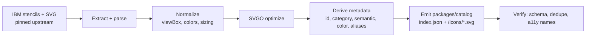

# Icon Catalog

The catalog is the bundled, offline, versioned set of IBM icons the editor draws from. It is
**generated at build time** from IBM's published stencils ([D11](00-decision-log.md#d11--build-time-icon-conversion-bundled-offline-catalog--locked)).

> **Status:** implemented ([Roadmap M2](09-roadmap.md#m2--icon-catalog-pipeline)).
> `packages/catalog-build` has generated `packages/catalog/2.0.0` — 207 icons across 10 categories
> (`ai`, `actors`, `applications`, `compute`, `data`, `devops`, `network`, `observability`,
> `security`, `storage`), pinned at upstream commit `32d9c311b`. A few details below differ from
> the original design once real icon data was in hand — noted inline.

## Source of truth

[IBM Cloud's published architecture-diagram guidance](https://cloud.ibm.com/docs/architecture-framework?topic=architecture-framework-architecture-diagram)
is normative for icon geometry and rendering. The repository below is the pinned asset and
supplemental inventory source; its raw SVG appearance does not override the published 20×20 glyph
in a white 48×48 outlined container.

[IBM-Cloud/architecture-icons](https://github.com/IBM-Cloud/architecture-icons) provides icons as
draw.io stencils (`drawio/stencils/2.0/`), draw.io templates, PowerPoint, and SVG. Per IBM's docs,
icons are **20×20 glyphs in a 48×48 container, white fill, 1px outline**, organized by category and
sorted groups-first, then by color, then alphabetically. Some icons are "complementary" (not yet
published natively in draw.io); we track those too.

We pin a specific upstream commit/tag per catalog `version` (e.g. `2.0.0`) so builds are
reproducible and `.icad` files that reference `catalog.version` always resolve.

## Build pipeline (`packages/catalog-build`)



Steps:

1. **Extract** shapes from the upstream `svg/` set (the draw.io stencil XML turned out to be
   redundant — the SVG export already carries every icon, including the "not released in draw.io"
   complementary set, and is far simpler to parse than mxGraph XML).
2. **Normalize**: each upstream file is a 48×48 colored tile with a white glyph on top. We strip
   that background tile (recording its color as the icon's accent), recolor the now-exposed white
   glyph to that accent color, and re-frame the glyph into the 20×20 viewBox `core/render` expects
   for its own white 48×48 container — reading the glyph's local size/offset from its
   `_Transparent_Rectangle_` hit-area rect when present, with a sensible default otherwise (see
   `packages/catalog-build/src/extract.ts`).
3. **Optimize** each SVG (SVGO) for crisp, small, inlineable assets; ids are namespaced per icon so
   the handful of icons using `clipPath`/`mask` don't collide when several share a canvas.
4. **Derive metadata** per icon: stable `id`, display `name`, `category`, default `semantic`,
   `color`, search `keywords`. (`aliases`, for old→new ID migration, will start being populated the
   first time the catalog version is bumped — nothing to alias from yet on the first cut.)
5. **Emit** `packages/catalog/<version>/` = an `index.json` manifest + individual optimized SVGs.
6. **Verify**: no duplicate IDs, every icon has an accessible name, every referenced asset file
   exists.

Re-running the pipeline against a newer upstream tag produces a new catalog version; we add
`aliases` for anything renamed so existing files migrate cleanly.

## Catalog manifest schema

```jsonc
// packages/catalog/2.0.0/index.json
{
  "id": "ibm-cloud",
  "version": "2.0.0",
  "upstream": {
    "repo": "IBM-Cloud/architecture-icons",
    "ref": "32d9c311b0dadb95f0fe4fa88b27f3af41c1dbc5"
  },
  "categories": [
    { "id": "compute",       "name": "Compute" },
    { "id": "network",       "name": "Network" },
    { "id": "storage",       "name": "Storage" },
    { "id": "security",      "name": "Security" },
    { "id": "data",          "name": "Data" },
    { "id": "devops",        "name": "DevOps" },
    { "id": "ai",            "name": "AI" },
    { "id": "actors",        "name": "Actors" },
    { "id": "applications",  "name": "Applications" },
    { "id": "observability", "name": "Observability" }
    /* Group/Boundary are native ICAD elements, not catalog icons — no "groups" category. */
  ],
  "icons": [
    {
      "id": "ibm-cloud/vpc",
      "name": "VPC",
      "category": "network",
      "semantic": "node",              // default IBM meaning when placed
      "container": "square",
      "color": "#1192E8",
      "asset": "icons/network/vpc.svg",
      "keywords": ["vpc"],
      "tier": "ibm-cloud"              // ibm-core | ibm-cloud | domains | third-party —
                                       // only "ibm-cloud" is populated so far; see below
    }
    // `aliases` (old→new ID, for migration) will appear on entries once the catalog is
    // re-generated against a newer upstream ref and something gets renamed.
  ]
}
```

> **Containers are not catalog entries.** Box/Group/Boundary (`zone` internally) ship as native ICAD engine primitives
> ([Architecture → Scene model](02-architecture.md#the-core)), not `icons[]` rows — deliberately no
> `groups` category above. IBM's kit does ship ~30 *named* container stencils (VPC, Subnet, Region,
> Availability Zone, Authorization Boundary, …), each with a preset icon/color/label. Per
> [D21](00-decision-log.md#d21--container-presets-are-a-named-shortcut-layer-not-new-element-types--locked),
> we don't fork these into new element types — instead the library panel offers them as one-click,
> pre-styled inserts over the three primitives. See the proposed table below.

## Container presets

A static lookup the library panel ([M7](09-roadmap.md#m7--chrome-templates-find-themes-carbon))
uses to offer named, pre-styled inserts: pick "VPC" and get a correctly colored, correctly bordered
Box with the VPC glyph in the corner and "VPC" as the label — instead of drawing a Box and manually
styling it. Each row is `{ name, kind, category color, corner icon }`; `kind` follows the
[Element semantics](05-ibm-spec-conformance.md#element-semantics) rule (Box = solid/`deployedOn`,
Group = dashed/`deployedTo`, Boundary = dotted boundary).

**Confidence:** rows marked `✓` reproduce IBM's own worked example from the kit exactly (border
style, color, and icon all confirmed). The rest are inferred from the kit's stencil legend — which
turned out to be internally inconsistent (its "OpenShift" swatch shows a solid border even though
the kit's own worked diagram uses a dashed one) — plus semantic reasoning from the [Element
semantics](05-ibm-spec-conformance.md#element-semantics) rule. Treat unmarked rows as a starting
draft, not a spec citation; confirm against IBM Design before shipping ([D17](00-decision-log.md#d17--official--ibm-internal-tool--locked)).

### IBM Core

| Name | Kind | Category | Corner icon |
|---|---|---|---|
| Cloud Services | Box | Network (blue) | — |
| Enterprise | Box | Generic (gray) | `ibm-cloud/enterprise` |
| Data Center | Box | Generic (gray) | — |
| Cloud Point of Presence | Box | Network (blue) | — |
| Virtual Server | Box | Compute (green) | `ibm-cloud/virtual-server` |
| Physical Server | Box | Compute (green) | `ibm-cloud/physical-server` |
| Authorization Boundary | Boundary | Security (red) | `ibm-cloud/authorization-boundary` |
| Overlay Network | Box | Network (blue) | `ibm-cloud/network-overlay` |
| Public Network | Box ✓ | Network (blue) | `ibm-cloud/public-network` |
| VLAN | Box | Network (blue) | `ibm-cloud/vlan` |
| VPC | Box | Network (blue) | `ibm-cloud/vpc` |
| Internet | Box | Network (blue) | `ibm-cloud/internet` |
| Subnet: ACL | Box | Network (blue) | `ibm-cloud/subnet-acl-rules` |
| OpenShift | Group ✓ | Compute (green) | `ibm-cloud/open-shift` |

### IBM Cloud

| Name | Kind | Category | Corner icon |
|---|---|---|---|
| IBM Cloud | Box ✓ | Network (blue) | `ibm-cloud/ibm-cloud` |
| Availability zone | Boundary ✓ | Generic (gray) | — |
| Region | Box ✓ | Generic (gray) | `ibm-cloud/location` |
| Instance group | Group | Compute (green) | `ibm-cloud/instance-group` |
| IBM Virtual Server | Box | Compute (green) | `ibm-cloud/virtual-server` |
| Classic Infrastructure | Box | Compute (green) | — |
| Internet services | Box | Network (blue) | `ibm-cloud/internet-services` |
| VPC Endpoints | Box | Network (blue) | `ibm-cloud/vpc-endpoints` |
| IBM Subnet: ACL | Box | Network (blue) | `ibm-cloud/subnet-acl-rules` |
| IBM Classic VLAN | Box | Network (blue) | `ibm-cloud/vlan-ibm` |
| IBM VPC | Box | Network (blue) | `ibm-cloud/ibm-cloud-vpc` |
| Account group | Boundary | Security (red) | — |
| Security group | Boundary | Security (red) | `ibm-cloud/group-security` |
| Access group | Boundary | Security (red) | — |
| Resource group | Boundary | Security (red) | — |

Rows with no corner icon have no matching glyph in the upstream `svg/` set as of the pinned
catalog version — ship them as a colored, labeled boundary with no icon, or pick a placeholder at
implementation time.

Source: *IBM_IT Architecture diagrams kit* v1.1, "Groups" slides, cross-checked against
[IBM-Cloud/architecture-icons](https://github.com/IBM-Cloud/architecture-icons)'s `svg/` tree and
the kit's own worked multi-zone OpenShift example.

## Runtime API (`core/catalog`)

The core loads the manifest for the pinned version and exposes:

```ts
catalog.search(query): IconMeta[];           // fuzzy over name/keywords/aliases
catalog.byCategory(id): IconMeta[];
catalog.resolve("ibm-cloud/vpc"): IconMeta;  // + aliases fallback
catalog.svg(id): string;                     // inlineable optimized SVG
```

The editor's shape/library panel groups by IBM category and tier, mirroring draw.io's grouping so
the tool feels familiar. Search matches the native + complementary sets, like the IBM draw.io
search.

## Licensing & branding

As an official IBM tool ([D17](00-decision-log.md#d17--official--ibm-internal-tool--locked)), use of the IBM icons and brand is sanctioned. We still
record the upstream `ref` and license in the manifest and honor the icon repo's terms. IBM Design
sign-off applies to how icons/colors are rendered.

## Versioning strategy

- Catalog versions are semver, independent of app version.
- `.icad` files pin a catalog version; the app bundles the current + a compatibility shim of
  `aliases` so older files resolve.
- Bumping the catalog is a deliberate, reviewed change (IBM Design sign-off), not automatic.
