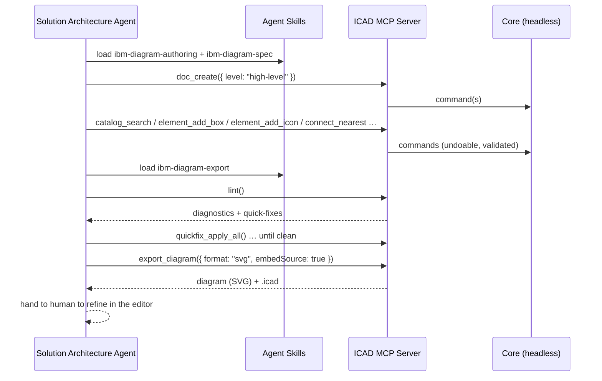

# Agent Integration (MCP + Skills)

> **v2 feature**, but the [core API](02-architecture.md#public-api-coreapi) is designed for it from
> day one. The MVP ([D20](00-decision-log.md#d20--mvp--editor-first-web-shell--locked)) ships the human editor; the agent surface follows.
>
> This document covers the MCP server and Agent Skills — the toolset an agent framework uses. For
> the actual autonomous agent that drives them end-to-end from natural language (a v6 feature), see
> [Agent Runtime](11-agent-runtime.md).

The goal is the flow sketched on the whiteboard: a **Solution Architecture agent** turns
requirements into inputs for a **GenerateArchitectureDiagram** tool, gets a diagram back, and a
human refines it. We deliver that with two things: an **MCP server** and a set of **Agent Skills**.

## Why this is clean here

Everything the human editor does is a [command](02-architecture.md#command-bus--history) against a
headless core with no UI dependency ([D2](00-decision-log.md#d2--framework-agnostic-typescript-core--thin-shells--locked)). The MCP server is a thin wrapper over the
**same** `core/api` — agents and humans drive one engine, so an agent-built diagram is a normal
`.icad` a person can open and edit, and vice-versa.

## MCP server (`packages/mcp`)

**Full authoring toolset** ([D15](00-decision-log.md#d15--mcp-full-authoring-toolset--locked-v2)) — fine-grained tools, not one black box, so agents can
build incrementally and self-correct via the linter.

### Tools (as shipped, M9.1)

25 tools across four groups (`packages/mcp/src/tools/`):

**Catalog & discovery**

- `catalog_search({ query })` → matching IBM icons (id, name, category, semantic).
- `catalog_categories()` → the list of icon categories.

**Document**

- `doc_create({ level, force? })` → new `.icad` scene from a template level (`blank` |
  `system-context` | `high-level` | `detailed`).
- `doc_open({ path, force? })` / `doc_save({ path? })`.
- `doc_get()` → current scene (elements, frames, meta).

**Authoring**

- `element_add_icon({ catalogRef, at, parentId?, label? })`
- `element_add_box` / `element_add_group` / `element_add_zone({ zoneKind? })` / `element_add_actor` / `element_add_text` / `element_add_frame({ name, order? })`
- `element_update({ id, patch })` / `element_move({ ids, dx, dy })` / `element_delete({ ids })`
- `connect({ from, to, connectorType?, direction?, flowColor?, cardinality?, label? })` (exact ports) /
  `connect_nearest({ fromId, toId, ... })` (auto-picked ports)
- `group_elements({ ids, padding? })` / `ungroup_element({ id })`
- `frame_reorder({ frameIds })`

**Conformance & output**

- `lint()` → diagnostics + counts + available quick-fixes.
- `quickfix_apply({ diagnosticId })` / `quickfix_apply_all({ ruleId? })`.
- `export_diagram({ format: "svg", embedSource?, path? })` → file/bytes. PNG is deferred (needs a
  real browser canvas, unproven headless — see [Roadmap M9.1](09-roadmap.md#m91--catalog-document-authoring-and-conformancesvg-export-tools)).
- `editor.open({ path })` → hand off to the human editor (when a shell is running) — **not yet
  implemented**; needs `apps/desktop`/VS Code IPC that doesn't exist (deferred past M9.1).

### Contract & safety

- Every mutating tool is a core command → **undoable, validated, migration-safe**.
- Tools return structured results (ids, bounds, lint deltas) so an agent can reason about what it
  built and iterate.
- The server operates on local `.icad` files, consistent with local-first ([D4](00-decision-log.md#d4--local-first-single-user-files--locked)); no network
  backend required.
- The [export gate](05-ibm-spec-conformance.md) applies to agents too — a "block" policy forces an
  agent to reach zero `error` diagnostics before it can export.

## Agent Skills

**Authoring + spec + export skill set** ([D16](00-decision-log.md#d16--authoring--spec--export-agent-skills--locked-v2)) — `SKILL.md` packages
(`packages/mcp/skills/`) that teach an agent to use the MCP well and produce **spec-compliant**
diagrams. Composable, not one monolith:

1. **`ibm-diagram-authoring`** — translate requirements → elements: choose the right diagram level,
   resolve icons via `catalog_search`, model `deployedOn`/`deployedTo` correctly, build outside-in
   and west→east, connect with proper IBM connector types. Includes a worked example (requirement →
   full tool-call sequence).
2. **`ibm-diagram-spec`** — the conventions reference (element semantics, color usage, connector
   nomenclature, categories/tiers, layout, linter rule categories) the authoring and export skills
   lean on and the linter enforces.
3. **`ibm-diagram-export`** — validate (`lint`) → resolve diagnostics via quick-fixes
   (`quickfix_apply`/`quickfix_apply_all`) → export canonical SVG (`export_diagram`; PNG deferred,
   see above) with or without embedded source, plus `doc_save` for the `.icad` itself.

Skills version alongside the MCP toolset and the [catalog](04-icon-catalog.md); `packages/mcp/src/skills.test.ts`
guards the docs against drift by asserting every tool name referenced in a `SKILL.md` is a real,
currently-registered MCP tool.

## End-to-end (the whiteboard flow)

This mirrors the sketched **Agent → Tool → Diagram** loop (and slots into an A2A client as the
"GenerateArchitectureDiagram" capability).
