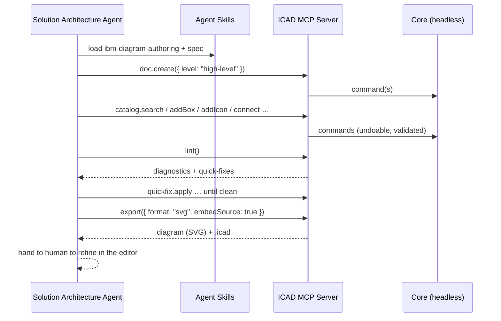

# Agent Integration (MCP + Skills)

> **v2 feature**, but the [core API](02-architecture.md#public-api-coreapi) is designed for it from
> day one. The MVP ([D20](00-decision-log.md#d20--mvp--editor-first-web-shell--locked)) ships the human editor; the agent surface follows.

The goal is the flow sketched on the whiteboard: a **Solution Architecture agent** turns
requirements into inputs for a **GenerateArchitectureDiagram** tool, gets a diagram back, and a
human refines it. We deliver that with two things: an **MCP server** and a set of **Agent Skills**.

## Why this is clean here

Everything the human editor does is a [command](02-architecture.md#command-bus--history) against a
headless core with no UI dependency ([D2](00-decision-log.md#d2--framework-agnostic-typescript-core--thin-shells--locked)). The MCP server is a thin wrapper over the
**same** `core/api` — agents and humans drive one engine, so an agent-built diagram is a normal
`.icad` a person can open and edit, and vice-versa.

## MCP server (`packages/mcp`)

**Full authoring toolset** ([D15](00-decision-log.md#d15--mcp-full-authoring-toolset--locked-v2)) — fine-grained tools, not one black box, so agents can
build incrementally and self-correct via the linter.

### Tools (illustrative)

**Catalog & discovery**
- `catalog.search({ query })` → matching IBM icons (id, name, category, semantic).
- `catalog.categories()` → category/tier tree.

**Document**
- `doc.create({ level })` → new `.icad` scene from a template level.
- `doc.open({ path })` / `doc.save({ path })`.
- `doc.get()` → current scene (elements, frames, meta).

**Authoring**
- `element.addIcon({ catalogRef, at, parentId, label })`
- `element.addBox|addGroup|addZone|addActor({ … })`
- `element.update({ id, patch })` / `element.move` / `element.delete`
- `connect({ from, to, connectorType })`
- `frame.add({ name, bounds, order })`

**Conformance & output**
- `lint()` → diagnostics + available quick-fixes.
- `quickfix.apply({ diagnosticId })`.
- `export({ format: "svg"|"png", embedSource })` → file/bytes.
- `editor.open({ path })` → hand off to the human editor (when a shell is running).

### Contract & safety

- Every mutating tool is a core command → **undoable, validated, migration-safe**.
- Tools return structured results (ids, bounds, lint deltas) so an agent can reason about what it
  built and iterate.
- The server operates on local `.icad` files, consistent with local-first ([D4](00-decision-log.md#d4--local-first-single-user-files--locked)); no network
  backend required.
- The [export gate](05-ibm-spec-conformance.md) applies to agents too — a "block" policy forces an
  agent to reach zero `error` diagnostics before it can export.

## Agent Skills

**Authoring + spec + export skill set** ([D16](00-decision-log.md#d16--authoring--spec--export-agent-skills--locked-v2)) — `SKILL.md` packages that teach an agent to
use the MCP well and produce **spec-compliant** diagrams. Composable, not one monolith:

1. **`ibm-diagram-authoring`** — translate requirements → elements: choose the right diagram level,
   pick icons, model `deployedOn`/`deployedTo` correctly, lay out west→east, connect with proper
   IBM connector types.
2. **`ibm-diagram-spec`** — the conventions reference (semantics, connector nomenclature,
   categories/tiers, layout rules) the authoring skill leans on and the linter enforces.
3. **`ibm-diagram-export`** — validate → resolve diagnostics via quick-fixes → export canonical
   SVG/PNG (with or without embedded source).

Skills version alongside the MCP toolset and the [catalog](04-icon-catalog.md), so guidance never
references tools or icons that don't exist.

## End-to-end (the whiteboard flow)

This mirrors the sketched **Agent → Tool → Diagram** loop (and slots into an A2A client as the
"GenerateArchitectureDiagram" capability).
