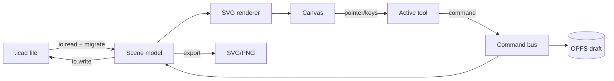

# Architecture

This document describes the system structure: the framework-agnostic core, the shells that mount
it, the rendering model, and how data and commands flow.

## Guiding principles

- **Core owns truth.** All scene state, mutations, undo, export, and linting live in a pure-TS
  core with no UI framework ([D2](./decision-log.md#d2--framework-agnostic-typescript-core--thin-shells--locked)). Shells are thin.
- **Everything is a command.** Every mutation goes through a command so undo/redo, autosave, and
  the future MCP server all share one entry point.
- **SVG is the render target and the export target.** One rendering path ([D3](./decision-log.md#d3--svg-dom-rendering--locked)) means what you
  see is what you export.
- **Semantics first.** Elements carry IBM meaning (`deployedOn`/`deployedTo`, node, actor), not
  just geometry. The linter and the agent API depend on this.

## Monorepo layout

A pnpm + TypeScript monorepo. The core has **no dependency** on any shell.

```
ibm-cloud-diagram/
├── packages/
│   ├── core/                 # framework-agnostic engine (the product)
│   │   ├── src/
│   │   │   ├── scene/        # document model, elements, layers, frames
│   │   │   ├── commands/     # command bus + all mutations (undo/redo)
│   │   │   ├── render/       # SVG DOM renderer (scene → SVG nodes)
│   │   │   ├── interaction/  # hit-testing, selection, tools, snapping
│   │   │   ├── connectors/   # ports, orthogonal routing, IBM connector types
│   │   │   ├── linter/       # spec rules + quick-fixes
│   │   │   ├── io/           # .icad read/write, SVG/PNG export, migrations
│   │   │   ├── catalog/      # runtime API over the bundled icon catalog
│   │   │   └── api/          # public imperative API (used by shells + MCP)
│   │   └── docs/             # core's own design docs (file format, spec, UX, a11y, parity)
│   ├── catalog/              # generated IBM icon catalog (from build pipeline)
│   ├── catalog-build/        # build-time IBM stencil → catalog converter (+ docs/)
│   ├── ui-web/               # Carbon + IBM Plex app chrome (React) for the web shell
│   └── mcp/                  # (v2) MCP server wrapping packages/core api (+ docs/)
├── apps/
│   ├── web/                  # v1 web shell (Vite): mounts core + ui-web (+ docs/)
│   ├── vscode/               # (v2) VS Code custom editor for .icad (+ docs/)
│   ├── desktop/              # (v3) Tauri shell — src-tauri/ only; wraps apps/web's own build (+ docs/)
│   └── agent/                # (v6) Deep Agents runtime over packages/mcp, exposed via A2A (+ docs/)
├── docs/                     # cross-cutting records only (see "Documentation layout" below)
└── README.md                 # the single documentation entry point
```

> Only `apps/web`, `packages/core`, `packages/catalog(-build)`, and `packages/ui-web` are in the
> **v1 MVP** ([D20](./decision-log.md#d20--mvp--editor-first-web-shell--locked)). `packages/mcp`
> and the other apps are stubs until v2/v3/v6 — see [Agent Runtime](../apps/agent/docs/agent-runtime.md) for
> `apps/agent` specifically.

## Documentation layout

Documentation follows the same rule as code: **a doc lives with the thing it describes.** Only
records that span more than one package stay at the repo root.

| Location              | Holds                                                                                                |
| --------------------- | ---------------------------------------------------------------------------------------------------- |
| `docs/`               | Cross-cutting only: architecture (this doc), decision log, vision & scope, roadmap, improvement plan |
| `docs/guide/`         | Cross-surface user entry points: getting started, file format & export                               |
| `docs/screenshots/`   | Every screenshot used anywhere, referenced from one place so no image is duplicated                  |
| `<package>/docs/`     | That package's own design docs                                                                       |
| `<package>/README.md` | What the package is, how to build/test it, and an index of its docs                                  |

The split test is **ownership, not topic**: a doc goes to the root only if changing one package
alone couldn't make it wrong. The decision log spans every package; the `.icad` file format is
core's to define even though four shells read it, so it lives in `packages/core/docs/`.

The root [`README.md`](../README.md) carries the full index — start there rather than browsing
folders.

**When adding a doc:** put it in the owning package's `docs/`, add a row to that package's README
index, and add it to the root README table only if it's a user-facing guide or a cross-cutting
record. Reference it from source comments by **repo-relative path**
(`packages/core/docs/editor-ux.md`), the convention the ~300 existing in-code references use, so a
path stays valid regardless of which file cites it.

## The core

### Scene model

An in-memory document: an ordered element list plus indexes. Elements are discriminated unions:

- `IconNode` — an IBM catalog icon (node/device). Square container per spec.
- `Box` — a `deployedOn` container (solid border).
- `Group` — a `deployedTo` container (dashed border).
- `Zone` — availability-zone/on-premises geographic boundary (dotted; D24).
- `Actor` — role/user (rounded).
- `Connector` — a routed edge with an IBM connector type, endpoints bound to ports.
- `Text` / `Label`, `Frame` (sectioning + presentation).

Every element has a stable `id`, geometry, style, a `semantic` field (the IBM meaning), and
optional `catalogRef` (for icons). Containers track membership so moving a box moves its contents.

### Command bus & history

Mutations are commands (`AddElement`, `MoveElements`, `Connect`, `SetSemantic`, `ApplyQuickFix`,
…). The bus applies a command, pushes an inverse onto the undo stack, and emits a change event.
Autosave and the MCP server both submit commands — never mutate the scene directly. This is what
makes the engine cleanly headless for [Agent Integration](../packages/mcp/docs/agent-integration.md).

### Rendering (SVG DOM)

The renderer reconciles the scene into SVG nodes (a lightweight keyed diff, no React in the core).
A single `<svg>` viewport with pan/zoom via transform; a static layer for elements and an overlay
layer for selection/handles/routing previews. Because the render target _is_ SVG, export is the
same tree serialized ([File Format](../packages/core/docs/file-format.md)).

### Interaction & tools

Pointer/keyboard events resolve to the active tool (select, box, group, zone, icon-place,
connector, text, frame). Hit-testing uses the DOM plus geometry math. Snapping: grid, element
edges/centers, and connector ports.

### Connectors

Ports are anchor points on shapes. The router produces orthogonal paths that avoid obstacles and
respect the west→east convention; users can drop manual waypoints. Connector _type_ carries IBM
nomenclature (line/arrow/dotted-end variants). See [Spec Conformance](../packages/core/docs/ibm-spec-conformance.md).

### Public API (`core/api`)

A stable imperative surface the shells and the MCP server both use:

```ts
const editor = createEditor({ container, catalog, theme });
editor.loadIcad(json);
editor.toIcad();
editor.commands.dispatch(cmd);
editor.history.undo();
editor.catalog.search("vpc");
editor.addIcon("ibm-cloud/vpc", { at });
editor.connect(portA, portB, { connectorType: "association" });
editor.lint(); // → diagnostics + quick-fixes
editor.export({ format: "svg", embedSource: true });
editor.on("change", handler);
```

## Shells

Shells provide chrome and host integration only; they call the core API.

- **`apps/web` (v1):** Vite app. Carbon + IBM Plex UI (`packages/ui-web`) around the core canvas.
  Persistence via File System Access API + fallback ([D9](./decision-log.md#d9--file-system-access-api--fallback--locked)); autosave/recovery via OPFS ([D10](./decision-log.md#d10--autosave-draft--crash-recovery--locked)).
- **`apps/vscode` (v2):** custom editor registered for `.icad`; core runs in the webview, the
  extension host handles file I/O.
- **`apps/desktop` (v3):** Tauri window; native file associations for `.icad`. Unlike
  `apps/vscode`, there's no separate frontend package — `tauri.conf.json` points straight at
  `apps/web`'s own build output, so it's `apps/web` unmodified plus a thin native bridge
  ([D22](./decision-log.md#d22--desktop-shell-reuses-webs-file-system-access--autosave-layer-unlike-vs-code--locked-v3)).

## Data flow (open → edit → save)



## Tech stack

- **Language:** TypeScript (strict). **Core:** no framework, no DOM-framework deps.
- **Rendering:** hand-written SVG DOM reconciler in the core.
- **Shell UI:** React + Carbon Design System + IBM Plex ([D18](./decision-log.md#d18--carbon-design-system--ibm-plex-for-app-chrome--locked)).
- **Build:** pnpm workspaces, Vite (web), tsup/rollup (packages).
- **Test:** Vitest (unit/core), Playwright (web E2E), axe/Equal Access checks in CI.
