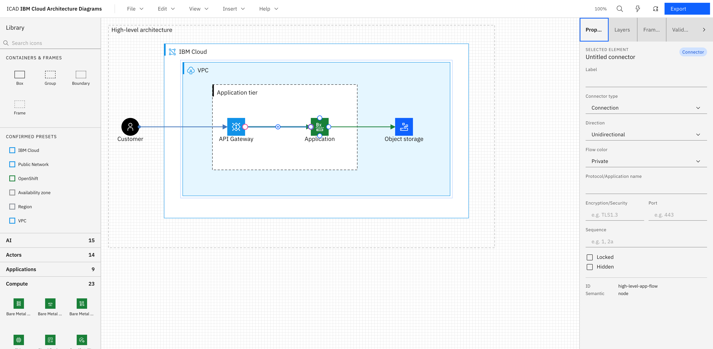

# The web editor

The full reference for `apps/web` — every element type, interaction, panel, and menu, as they
actually behave today. Screenshots below are the built-in **High-level / logical** template
(light theme) at 100% zoom.

## Layout

- **Top bar** — File / Edit / View / Insert / Help menus, a live zoom readout, Find, Command
  palette, a Theme menu (Auto/Light/Dark), and Export.
- **Left — Library panel** — searchable IBM icon catalog, plus container primitives and confirmed
  presets.
- **Center — Canvas** — the SVG diagram surface.
- **Right — Inspector** — four tabs: Properties, Layers, Frames, Validation.

There is no separate toolbar strip — every insert action lives in the **Insert** menu or the
Library panel, and there's no ruler along the canvas edges.

## Elements and their IBM semantics

| Element               | Border         | IBM semantic            | Meaning                                                                                                                                                                                                                                                          |
| --------------------- | -------------- | ----------------------- | ---------------------------------------------------------------------------------------------------------------------------------------------------------------------------------------------------------------------------------------------------------------- |
| **Box**               | solid          | `deployedOn`            | A location something runs on (a VPC, a server, a cluster).                                                                                                                                                                                                       |
| **Group**             | dashed         | `deployedTo`            | A grouping of services/apps that share a deployment target.                                                                                                                                                                                                      |
| **Zone** ("Boundary") | dashed         | `boundary`              | An availability zone or on-premises boundary — the only two `ZoneKind`s; region/VPC/subnet render as **Box** instead ([D24](../00-decision-log.md#d24--regionvpcsubnet-are-box-only-availability-zoneon-prem-are-boundary--locked)). Set the kind in Properties. |
| **Actor**             | rounded        | `actor`                 | A person or external role.                                                                                                                                                                                                                                       |
| **Icon** (`iconNode`) | —              | `node`                  | A single IBM Cloud service/component from the catalog.                                                                                                                                                                                                           |
| **Text**              | —              | —                       | A free-floating label.                                                                                                                                                                                                                                           |
| **Frame**             | dashed, titled | —                       | A named section used for Find, navigation, and presentation mode — not a diagram element with IBM meaning of its own.                                                                                                                                            |
| **Connector**         | —              | connection/relationship | See [Connectors](#connectors) below.                                                                                                                                                                                                                             |

Boxes, Groups, Zones, and Frames are all **containers**: dropping or reparenting an element into
one sets `parentId`, and moving or deleting the container cascades to everything inside it.
Reparenting happens either by dragging an icon's placement point into a container, or by picking a
new **Parent container** in the Properties tab.

## Placing icons

Click an icon in the Library panel to arm it, then click anywhere on the canvas to place it at
that point — or press **Enter/Space** on a focused icon to place it at the center of the current
viewport. There's no drag-and-drop from the Library onto the canvas today.

Search filters by id, name, keyword, and alias. Results are grouped by category (Compute, Network,
Storage, Security, Data, DevOps, AI, Observability, Applications, Actors, Groups — 242 icons
total). The **Containers & frames** section places Box/Group/Boundary/Frame primitives; **Confirmed presets**
places four curated, IBM-approved container/color combinations (IBM Cloud, Public Network,
OpenShift, Availability zone).

## Canvas interactions

- **Pan** — scroll wheel, Space+drag, or middle-mouse-drag. **Zoom** — Ctrl/Cmd+scroll, or the Zoom
  in/out/Reset/Fit-to-content commands in the View menu or command palette. A live grid and
  alignment guides render while dragging, with a gesture readout (position/size/angle) near the
  cursor.
- **Select** — click (always resolves to the deepest element under the cursor); Alt+click to
  select through to an occluded element underneath; Shift-click to add to selection; a
  marquee-drag over empty canvas selects every fully-enclosed element; Ctrl/Cmd+A selects all;
  keyboard Enter/Shift+Enter on a focused element. Right-click opens a context menu scoped to
  whatever's under the cursor.
- **Move** — drag with the mouse (Shift axis-locks to horizontal/vertical, Escape aborts and snaps
  back, Alt-drag clones instead of moving), or arrow keys to nudge the selection by 1px (8px with
  Shift). Dragging snaps live to the grid, sibling edges/centers, and a 16px container inset. To
  set an exact position, type X/Y in the Properties tab instead.
- **Resize** — drag any of 8 handles on a selected element (Shift locks aspect ratio, Alt resizes
  from center); a container resize reflows its children and the 16px inset is enforced live.
  Dragging an element onto/out of a container highlights it as a drop target and reparents on
  release; a container also auto-grows to keep a dragged child inside it.
- **Rotate** — drag the rotation handle above a selected element; Shift snaps to 15° increments.
  Hit-testing, handles, ports, and bounds are all rotation-aware.
- **Double-click** a container to drill into it (both the outer and inner bounding boxes stay
  visible); Escape steps back out.
- **Arrange** — Bring to front/forward, Send backward/to back (Ctrl/Cmd+]/[, Shift for
  front/back), 6-way align (left/center/right/top/middle/bottom) and horizontal/vertical
  distribute, and per-element Lock/Hide — all in the Edit menu, command palette, or (for
  align/distribute) a toolbar that appears with a 2+ element selection.
- **Clipboard** — Ctrl/Cmd+C/X/V copy, cut, and paste; Ctrl/Cmd+D duplicates; paste lands at the
  cursor position. This is an in-app clipboard for diagram elements, not a copy-to-clipboard for
  rendered PNG/SVG images (see [Export](#export)).
- **Group / ungroup** — select 2+ elements and press Ctrl/Cmd+G (or use the Edit menu / command
  palette). This creates a new dashed Group sized to fit the selection plus a 16px pad, and
  reparents the selected elements into it. Ctrl/Cmd+Shift+G ungroups.
- **Undo / redo** — Ctrl/Cmd+Z / Ctrl/Cmd+Shift+Z (or Ctrl/Cmd+Y), unlimited within a session. Only
  committed edits are undoable — in-flight drag/resize/rotate gestures aren't part of the undo
  stack until released.
- **Delete** — Delete/Backspace removes the selection and cascades to descendants and any
  connectors left dangling.

## Connectors

Hover any element to reveal N/E/S/W port markers, then drag from a port to a target element or
port to connect. Alternatively, focus a source element, press **c**, Tab to the target, and press
Enter — the full flow works without a mouse. There's also a "connect nearest" behavior that
auto-picks reasonable ports when you don't care which side.

Pick the exact connector type, direction (unidirectional/bidirectional), and flow color
(public/private) in the Properties tab once a connector is selected — there are 11 IBM connector
types in total, covering both **connections** (association, data flow, sync/async call, public,
private) and **relationships** (dependency, aggregation, composition, implementation, extension,
inheritance). A connection also takes a structured protocol annotation (Name, Encryption/Security,
Port — rendered as `HTTPS TLS1.3:443`; a tunnel type reads "Encapsulation name" instead), and any
connector can carry a short sequencing badge (e.g. "1", "2a") shown at its midpoint. Routing is
orthogonal and automatic by default, but a selected connector exposes diamond drag handles on every
waypoint, a `+` handle at each segment's midpoint to insert a new one, and pink endpoint handles to
retarget either end to a different port — auto-routing connectors re-route immediately around the
edited path. A "Reset routing" button in the Properties tab drops any manual edits and returns to
automatic routing.

## Templates

`File → New` (or the New Diagram dialog on first launch) offers four starting points — see
[Getting started](01-getting-started.md#your-first-diagram) for what each contains. Templates
encode IBM conventions (correct containment, west→east flow, on-spec colors) so a new diagram
starts clean.

## Properties, Layers, Frames, Validation

The right-hand Inspector has four tabs.

**Properties** — edit the selection. Every element has a Label field; non-connector elements also
get typed X/Y/W/H and Rotation (0–359°) fields and a Parent container selector; Zones get a
boundary-kind selector; Frames get a presentation-order field; Connectors get
type/direction/flow-color selectors. Stroke and fill are set from the nine IBM palette swatches or
a free-form custom color picker; a Locked/Hidden pair of checkboxes mirrors the same toggles in
Layers.

**Layers** — the full containment tree in descending z-order, click any node to select it on
canvas; each row also has its own Lock and Hide toggle.

**Frames** — lists frames in presentation order; a **Present** button steps through them
(PageUp/PageDown or arrow keys, Escape to exit) — useful for reviews.

**Validation** — the linter's output. See below.

## The linter

ICAD ships an advisory linter (`core/linter`, 16 rules) covering container semantics, IBM color
usage, missing/duplicate labels, connector correctness (dangling connectors, unbound ports,
non-standard types, malformed protocol annotations), and west→east layout. Each diagnostic is
`error`/`warn`/`info`, targets a specific element, and — where possible — offers a one-click fix.

Fixes are ordinary undoable commands, so **Undo** reverts a quick-fix like any other edit. Rule
severities are configurable per document (**Rule settings**, in the Validation tab), and the
**export gate** (Warn/Block, set in the Export dialog) decides whether an `error`-level diagnostic
is allowed to block export.

## Find on canvas

**Ctrl/Cmd+F** searches element labels, resolved icon names, and frame names. Matches are numbered
(`i / N`); Next/Previous step through them and the viewport jumps to each one, including jumping
straight to a section frame.

## Themes

Auto / Light / Dark, set from the Theme menu in the top bar, the View menu, or the command palette:

"Auto" follows the OS via `prefers-color-scheme` and updates live. The choice persists in
`localStorage`, independent of any single `.icad` file's own saved theme — opening a file adopts
that file's theme.

## Command palette

**Ctrl/Cmd+K** opens a searchable list of every File/Edit/View/Insert action, plus one "Go to
frame: …" entry per frame and a Present/Exit-presentation toggle. Every command palette entry also
has a direct keyboard shortcut where one exists.

## Files: open, save, autosave, and recovery

- **Open / Save / Save As** use the File System Access API on Chromium-based browsers for a real
  round-trip to a file on disk; Safari/Firefox fall back to upload/download.
- **Autosave** writes to IndexedDB roughly 800ms after any change. If the tab closes or crashes
  before you save, reopening the app offers to restore that draft.

## Export

The Export dialog offers **SVG** (canonical — spec colors, always embeds the diagram's full
`.icad` source so the file is re-openable and editable) or **PNG** (rasterized at 1×/2×/3×,
transparent or white background). The dialog also shows the linter's compliance summary and lets
you set the export gate for this export.

See [File format & export](06-file-format-and-export.md) for the full `.icad` schema and export
details.

## Limitations

Direct manipulation (drag-to-move/resize/rotate, marquee select, align/distribute/z-order, grid
and alignment-guide snapping, connector-waypoint editing, clipboard copy/paste/duplicate) is fully
built — see [Canvas interactions](#canvas-interactions) and [Connectors](#connectors) above. What's
still missing:

- **No native drag-and-drop icon placement from the Library panel** — click an icon to arm it,
  then click the canvas (or press Enter/Space to place at the viewport center); dragging an icon
  straight from the panel onto the canvas isn't supported.
- **No copy-to-clipboard for a rendered PNG/SVG image.** Export always goes to Save/Save-As (or a
  browser download); there's no button that puts the exported image bytes on the OS clipboard. (The
  in-app element clipboard — Ctrl/Cmd+C/X/V/D for diagram elements — is a separate, already-built
  feature; see [Canvas interactions](#canvas-interactions).)
- **No viewport virtualization.** Every element stays in the live DOM regardless of diagram size;
  a benchmark found no real rendering/hit-test/lint problem up to 2,000 elements and connectors, so
  this hasn't been built, but a genuinely huge diagram beyond that size is untested.
