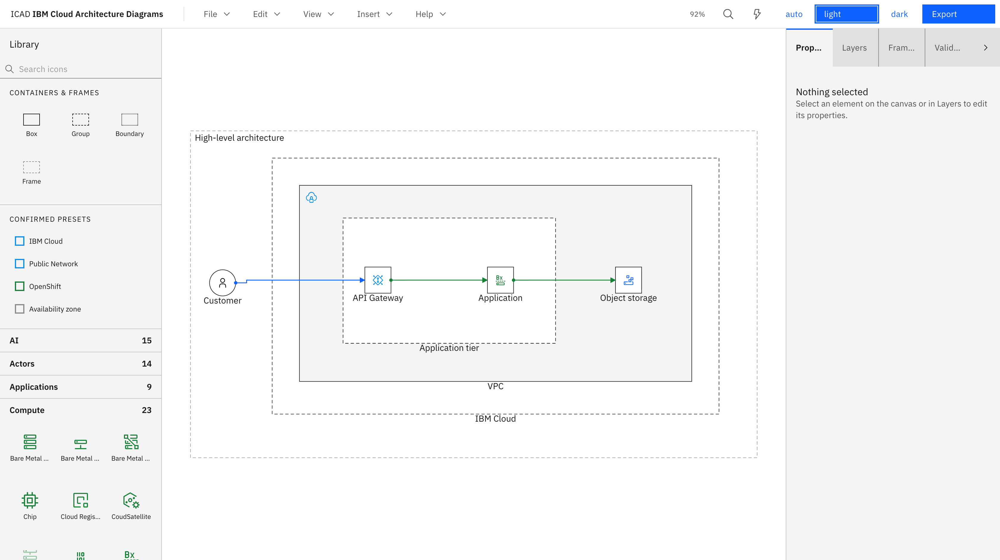
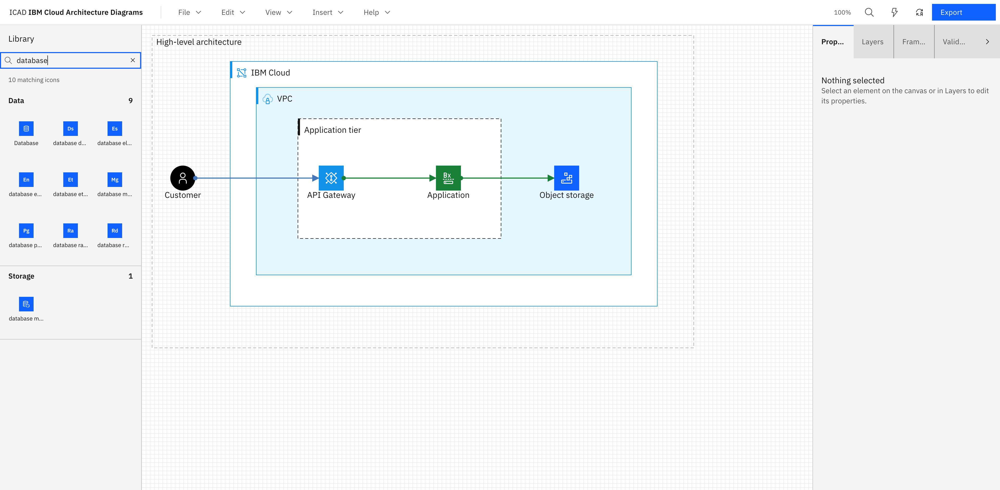
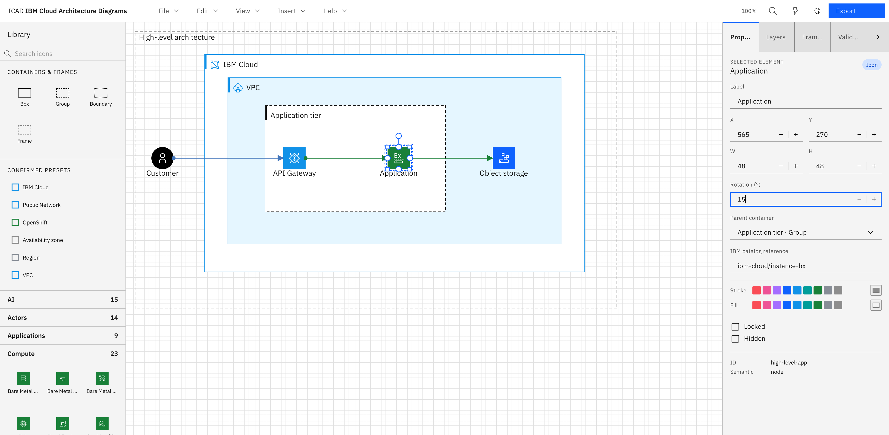
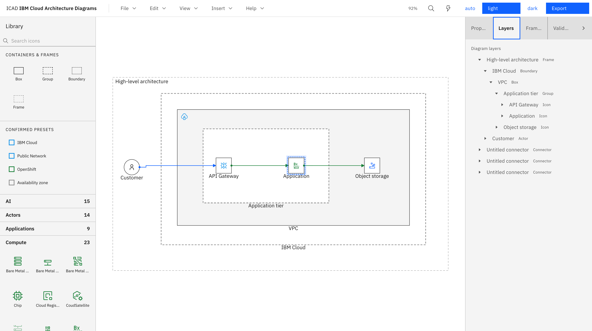
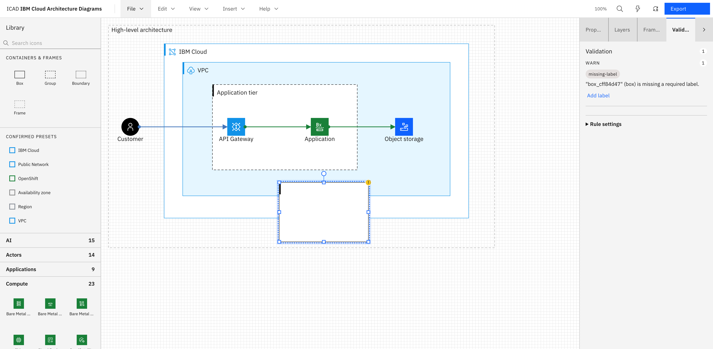
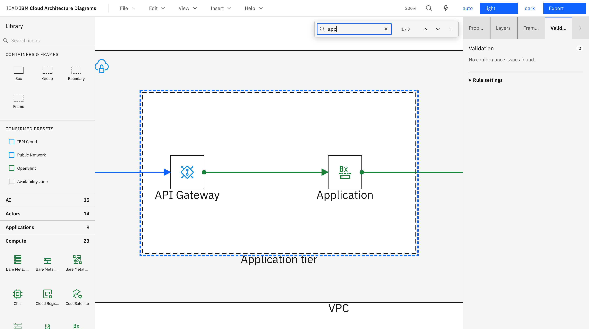
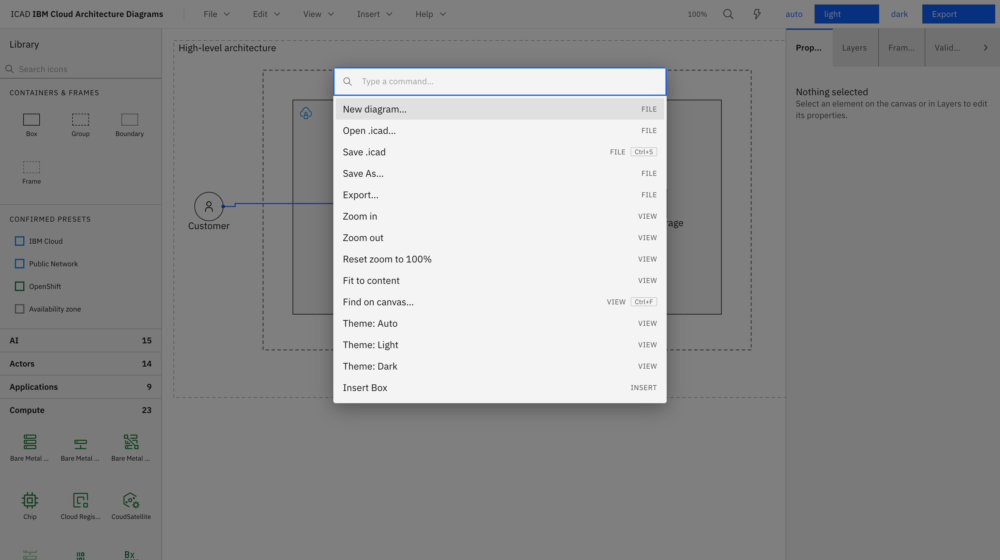

# The web editor

The full reference for `apps/web` — every element type, interaction, panel, and menu, as they
actually behave today. Screenshots below are the built-in **High-level / logical** template
(light theme) at 100% zoom.

## Layout

- **Top bar** — File / Edit / View / Insert / Help menus, a live zoom readout, Find, Command
  palette, theme buttons (Auto/Light/Dark), and Export.
- **Left — Library panel** — searchable IBM icon catalog, plus container primitives and confirmed
  presets.
- **Center — Canvas** — the SVG diagram surface.
- **Right — Inspector** — four tabs: Properties, Layers, Frames, Validation.

There is no separate toolbar strip — every insert action lives in the **Insert** menu or the
Library panel, and there's no ruler along the canvas edges.

## Elements and their IBM semantics

| Element               | Border         | IBM semantic            | Meaning                                                                                                               |
| --------------------- | -------------- | ----------------------- | --------------------------------------------------------------------------------------------------------------------- |
| **Box**               | solid          | `deployedOn`            | A location something runs on (a VPC, a server, a cluster).                                                            |
| **Group**             | dashed         | `deployedTo`            | A grouping of services/apps that share a deployment target.                                                           |
| **Zone** ("Boundary") | dashed         | `boundary`              | A region, availability zone, VPC, subnet, or on-prem boundary. Set the kind in Properties.                            |
| **Actor**             | rounded        | `actor`                 | A person or external role.                                                                                            |
| **Icon** (`iconNode`) | —              | `node`                  | A single IBM Cloud service/component from the catalog.                                                                |
| **Text**              | —              | —                       | A free-floating label.                                                                                                |
| **Frame**             | dashed, titled | —                       | A named section used for Find, navigation, and presentation mode — not a diagram element with IBM meaning of its own. |
| **Connector**         | —              | connection/relationship | See [Connectors](#connectors) below.                                                                                  |

Boxes, Groups, Zones, and Frames are all **containers**: dropping or reparenting an element into
one sets `parentId`, and moving or deleting the container cascades to everything inside it.
Reparenting happens either by dragging an icon's placement point into a container, or by picking a
new **Parent container** in the Properties tab.

## Placing icons

Click an icon in the Library panel to arm it, then click anywhere on the canvas to place it at
that point — or press **Enter/Space** on a focused icon to place it at the center of the current
viewport. There's no drag-and-drop from the Library onto the canvas today.

Search filters by id, name, keyword, and alias. Results are grouped by category (Compute, Network,
Storage, Security, Data, DevOps, AI, Observability, Applications, Actors, Groups — 242 icons
total). The **Containers & frames** section places Box/Group/Boundary/Frame primitives; **Confirmed presets**
places four curated, IBM-approved container/color combinations (IBM Cloud, Public Network,
OpenShift, Availability zone).

## Canvas interactions

- **Pan** — scroll wheel. **Zoom** — Ctrl/Cmd+scroll, or the Zoom in/out/Reset/Fit-to-content
  commands in the View menu or command palette.
- **Select** — click; Shift-click to add to selection; keyboard Enter/Shift+Enter on a focused
  element.
- **Move** — arrow keys nudge the selection by 1px (8px with Shift). There's no click-and-drag
  repositioning; to set an exact position, type X/Y in the Properties tab.
- **Group / ungroup** — select 2+ elements and press Ctrl/Cmd+G (or use the Edit menu / command
  palette). This creates a new dashed Group sized to fit the selection plus a 16px pad, and
  reparents the selected elements into it. Ctrl/Cmd+Shift+G ungroups.
- **Undo / redo** — Ctrl/Cmd+Z / Ctrl/Cmd+Shift+Z (or Ctrl/Cmd+Y), unlimited within a session.
- **Delete** — Delete/Backspace removes the selection and cascades to descendants and any
  connectors left dangling.

## Connectors

Hover any element to reveal N/E/S/W port markers, then drag from a port to a target element or
port to connect. Alternatively, focus a source element, press **c**, Tab to the target, and press
Enter — the full flow works without a mouse. There's also a "connect nearest" behavior that
auto-picks reasonable ports when you don't care which side.

Pick the exact connector type, direction (unidirectional/bidirectional), and flow color
(public/private) in the Properties tab once a connector is selected — there are 11 IBM connector
types in total, covering both **connections** (association, data flow, sync/async call, public,
private) and **relationships** (dependency, aggregation, composition, implementation, extension,
inheritance). A connection also takes a structured protocol annotation (Name, Encryption/Security,
Port — rendered as `HTTPS TLS1.3:443`; a tunnel type reads "Encapsulation name" instead), and any
connector can carry a short sequencing badge (e.g. "1", "2a") shown at its midpoint. Routing is
orthogonal and automatic; there's no gesture for manually editing a connector's waypoints today.

## Templates

`File → New` (or the New Diagram dialog on first launch) offers four starting points — see
[Getting started](01-getting-started.md#your-first-diagram) for what each contains. Templates
encode IBM conventions (correct containment, west→east flow, on-spec colors) so a new diagram
starts clean.

## Properties, Layers, Frames, Validation

The right-hand Inspector has four tabs.

**Properties** — edit the selection. Every element has a Label field; non-connector elements also
get typed X/Y/W/H fields and a Parent container selector; Zones get a boundary-kind selector;
Frames get a presentation-order field; Connectors get type/direction/flow-color selectors. Fill,
stroke, and rotation aren't editable here — style comes from presets and linter quick-fixes, and
rotation isn't implemented in the UI.

**Layers** — the full containment tree, click any node to select it on canvas.

**Frames** — lists frames in presentation order; a **Present** button steps through them
(PageUp/PageDown or arrow keys, Escape to exit) — useful for reviews.

**Validation** — the linter's output. See below.

## The linter

ICAD ships an advisory linter (`core/linter`, 16 rules) covering container semantics, IBM color
usage, missing/duplicate labels, connector correctness (dangling connectors, unbound ports,
non-standard types, malformed protocol annotations), and west→east layout. Each diagnostic is
`error`/`warn`/`info`, targets a specific element, and — where possible — offers a one-click fix.

Fixes are ordinary undoable commands, so **Undo** reverts a quick-fix like any other edit. Rule
severities are configurable per document (**Rule settings**, in the Validation tab), and the
**export gate** (Warn/Block, set in the Export dialog) decides whether an `error`-level diagnostic
is allowed to block export.

## Find on canvas

**Ctrl/Cmd+F** searches element labels, resolved icon names, and frame names. Matches are numbered
(`i / N`); Next/Previous step through them and the viewport jumps to each one, including jumping
straight to a section frame.

## Themes

Auto / Light / Dark, set from the top bar, the View menu, or the command palette:

"Auto" follows the OS via `prefers-color-scheme` and updates live. The choice persists in
`localStorage`, independent of any single `.icad` file's own saved theme — opening a file adopts
that file's theme.

## Command palette

**Ctrl/Cmd+K** opens a searchable list of every File/Edit/View/Insert action, plus one "Go to
frame: …" entry per frame and a Present/Exit-presentation toggle. Every command palette entry also
has a direct keyboard shortcut where one exists.

## Files: open, save, autosave, and recovery

- **Open / Save / Save As** use the File System Access API on Chromium-based browsers for a real
  round-trip to a file on disk; Safari/Firefox fall back to upload/download.
- **Autosave** writes to IndexedDB roughly 800ms after any change. If the tab closes or crashes
  before you save, reopening the app offers to restore that draft.

## Export

The Export dialog offers **SVG** (canonical — spec colors, always embeds the diagram's full
`.icad` source so the file is re-openable and editable) or **PNG** (rasterized at 1×/2×/3×,
transparent or white background). The dialog also shows the linter's compliance summary and lets
you set the export gate for this export.

See [File format & export](06-file-format-and-export.md) for the full `.icad` schema and export
details.

## Limitations

The editor is click-and-type first, not a full drag/direct-manipulation canvas yet:

- **No drag-to-move, resize, or rotate.** Position and size are set via typed Properties fields;
  the schema has a `rotation` field but nothing renders or exposes it.
- **No marquee/rubber-band selection and no Ctrl/Cmd+select-all.** Multi-select is Shift-click
  only.
- **No align, distribute, or z-order commands.**
- **No grid or alignment-guide snapping.** Only connector ports snap.
- **No manual connector-waypoint editing** — routing is fully automatic.
- **No clipboard copy** (no copy-to-clipboard for PNG/SVG).
- **No native drag-and-drop icon placement** — click-to-arm-then-click, or keyboard placement.
