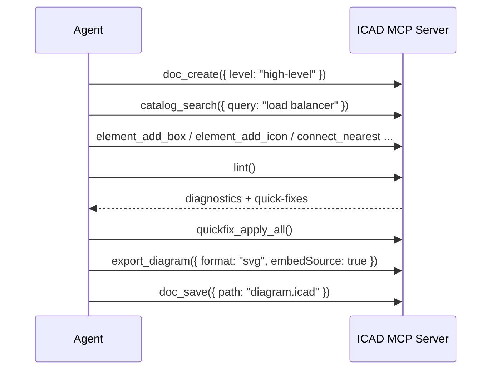

# AI agents & MCP

`packages/mcp` is an [MCP](https://modelcontextprotocol.io) server that wraps the same
`@icad/core` engine the human editors use, as a full authoring toolset for AI agents: 46 tools
across catalog search, document I/O, element authoring, and conformance/export — every mutating
tool is a real core command, so anything an agent builds is undoable, validated against the
linter, and opens as a normal `.icad` file a person can then edit by hand.

## Building and running the server

```bash
pnpm install
pnpm --filter @icad/mcp build
```

This produces `packages/mcp/dist/index.js`, a stdio MCP server (stdio is the only transport
implemented — no HTTP/SSE). Point your MCP client at it directly with Node:

```json
{
  "mcpServers": {
    "icad": {
      "command": "node",
      "args": [
        "/absolute/path/to/ibm-cloud-diagram/packages/mcp/dist/index.js"
      ],
      "env": { "ICAD_MCP_WORKSPACE_ROOT": "/absolute/path/to/your/diagrams" }
    }
  }
}
```

Building from source this way must run from inside a full clone of this repo — the server loads
the bundled icon catalog from `packages/catalog` relative to its own build output, so it isn't a
standalone package you can point at an arbitrary directory. If you don't want a full clone, a
standalone preview tarball (unsigned, see the root README's positioning note) is published to the
[GitHub Releases page](https://github.com/iChintanSoni/ibm-cloud-architecture-diagram/releases)
on tagged pushes — extract it and point your client at `mcp/dist/index.js` inside it (keep the
extracted `mcp/` and `catalog/` directories together; see the tarball's own `mcp/README.md`).

Two things worth knowing before you wire this up:

- **`doc_open`/`doc_save`/`export_diagram`'s `path` argument is confined to a workspace root**
  (I13, [Improvement plan](../../../docs/improvement-plan.md#i13--mcp-filesystem-confinement)): a
  `..` traversal, an absolute path outside the root, a symlink that resolves back out of it, a
  path through a `.git` directory, or a disallowed extension (`.icad` for
  `doc_open`/`doc_save`, `.svg` for `export_diagram`) is refused outright, not silently
  reinterpreted. `ICAD_MCP_WORKSPACE_ROOT` sets the root; unset, it falls back to the server
  process's own working directory. Relative `path` arguments resolve against that root, not your
  MCP client's own `cwd` — if your client config sets a different one, prefer absolute paths (they
  still have to resolve inside the root).
- **Overwriting a pre-existing file needs `force: true`** unless this session is the one that
  created or opened it — `doc_save`/`export_diagram` refuse a silent clobber of something already
  on disk that this session doesn't know about.

No API keys or network access are required — it's fully local and offline, reading and writing
`.icad` files on disk within the confined workspace root.

## The tools

**Catalog & discovery** — usable before any document is open:

- `catalog_search({ query })` — find IBM icons by name/keyword/alias; returns the `id` to pass as
  `catalogRef`.
- `catalog_categories()` — list categories.

**Document** — every other tool requires a document opened first:

- `doc_create({ level, force? })` — new document from a template (`blank` | `system-context` |
  `high-level` | `detailed`).
- `doc_open({ path, force? })` / `doc_save({ path? })`.
- `doc_get()` — the full current scene as JSON.

`doc_create`/`doc_open` refuse to replace unsaved changes unless you pass `force: true` — there's
one document per server process for its whole lifetime, not a multi-document session model.

**Authoring** (36 tools):

- _Create_ — `element_add_icon`, `element_add_box`, `element_add_group`, `element_add_zone`,
  `element_add_actor`, `element_add_text`, `element_add_frame`.
- _Modify_ — `element_update`, `element_move`, `element_delete`, `element_rotate`,
  `element_reparent`.
- _Connect_ — `connect` (exact ports), `connect_nearest` (auto-picked ports),
  `connector_retarget`, `connector_reset_routing`.
- _Group & frame_ — `group_elements`, `ungroup_element`, `frame_reorder`.
- _Align_ — `element_align_left`, `element_align_right`, `element_align_top`,
  `element_align_bottom`, `element_align_center_horizontal`, `element_align_middle`.
- _Distribute_ — `element_distribute_horizontal`, `element_distribute_vertical`.
- _Z-order_ — `element_bring_to_front`, `element_bring_forward`, `element_send_backward`,
  `element_send_to_back`.
- _Visibility_ — `element_lock`, `element_unlock`, `element_hide`, `element_show`.
- _Batch_ — `scene_apply`, which applies many of the above in one call as a single undo step.
  Prefer it when building a diagram from scratch; see the `ibm-diagram-authoring` skill for how to
  shape a batch.

**Conformance & export**:

- `lint()` — diagnostics, counts by severity, and which have a quick-fix available.
- `quickfix_apply({ diagnosticId })` / `quickfix_apply_all({ ruleId? })` — diagnostic ids come
  from the most recent `lint()` call and go stale once used or once the scene changes again.
- `export_diagram({ format: "svg", embedSource?, path? })` — **SVG only**; a `format: "png"`
  request fails schema validation outright (PNG export needs a real browser canvas, which isn't
  available headlessly yet).

## Agent Skills

Three composable `SKILL.md` packages under `packages/mcp/skills/`, meant to be loaded by an
agent framework that supports the Skills convention:

1. **`ibm-diagram-authoring`** — the workflow: read a requirement, pick a diagram level, resolve
   every icon via `catalog_search` (never invent a `catalogRef`), build outside-in with correct
   `parentId` containment, connect with the right connector type, lint incrementally. Includes a
   full worked example.
2. **`ibm-diagram-spec`** — the standalone conventions reference (element semantics, color usage,
   connector nomenclature, layout rules, linter rule categories) — doesn't require repo access.
3. **`ibm-diagram-export`** — validate → fix → export: `lint()` → `quickfix_apply_all()` (or
   targeted `quickfix_apply`) → re-lint → `export_diagram()` → `doc_save()`.

## A worked example



The resulting `.icad` opens identically in the [web editor](../../../apps/web/docs/web-editor.md),
[VS Code](../../../apps/vscode/docs/vscode-extension.md), or [desktop app](../../../apps/desktop/docs/desktop-app.md) — agent-built and
human-built diagrams are the same file format, edited through the same engine.

## Limitations

- **PNG export isn't supported** — only SVG.
- **One document per server process**, for its whole life — no multi-document sessions.
- **No handoff to a running human editor.** There's no tool to open a diagram in an already-running
  web/VS Code/desktop instance yet.
- **stdio only** — no HTTP/SSE transport.
- **Not published to npm.** The from-source build is monorepo-coupled; the standalone preview
  tarball (above) is the only way to run it without a full clone.
